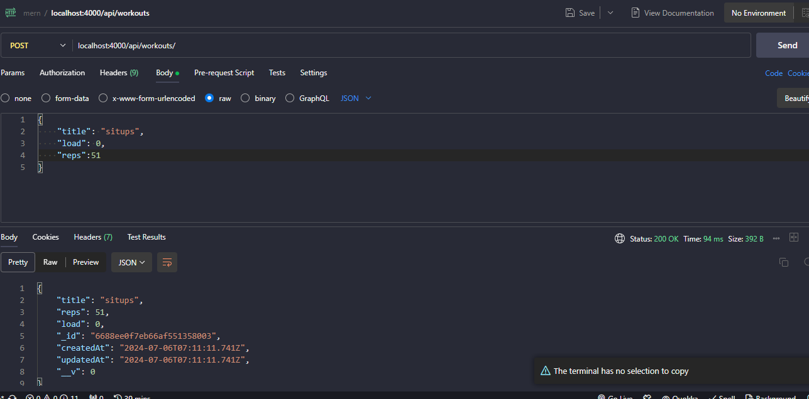
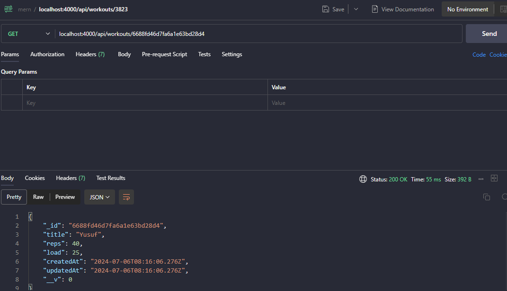
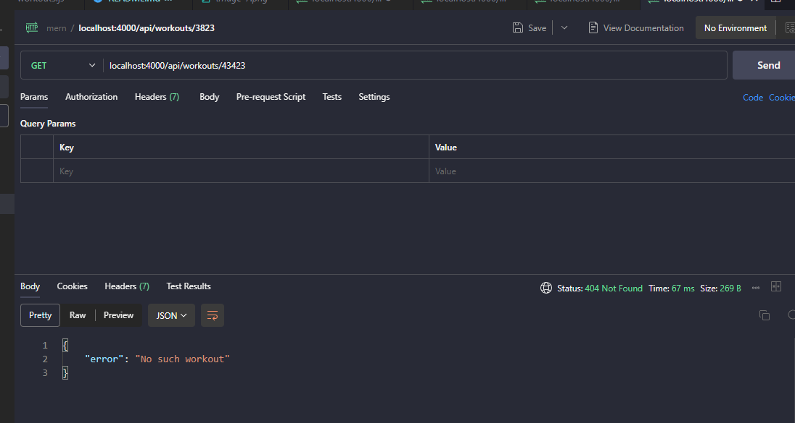
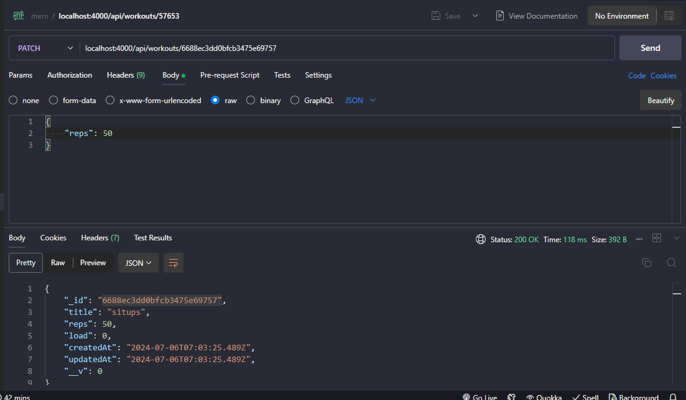
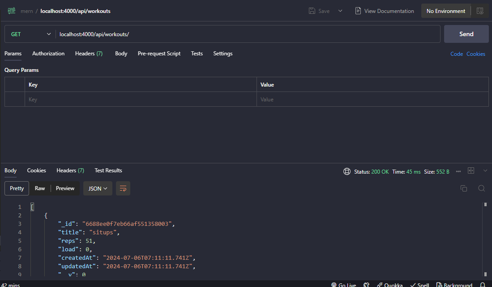

# Mern Stack Muhammad Yusuf
## Penjelasan Video 1
1. **Pengenalan MERN Stack**: MERN stack terdiri dari empat teknologi—MongoDB, Express, React, dan Node.js—yang digunakan bersama untuk membuat aplikasi web interaktif dan berbasis data. Menguasai MERN stack membuat Anda menjadi pengembang full-stack yang mampu membangun bagian depan (front end) dan belakang (back end) dari sebuah situs web.

2. **Penjelasan Teknologi**:
   - **React**: Library front-end untuk membuat antarmuka pengguna dan menangani routing.
   - **Node.js dan Express**: Digunakan untuk membangun API backend yang menangani permintaan dari front-end.
   - **MongoDB**: Database NoSQL untuk menyimpan data aplikasi seperti data pengguna atau blog.

3. **Cara Kerja**: Aplikasi React berjalan di browser untuk menampilkan situs web dan mengirim permintaan data ke backend. Backend (Express di lingkungan Node.js) menangani permintaan ini, berinteraksi dengan database untuk mendapatkan, memperbarui, atau menghapus data, dan kemudian mengirim respons kembali ke aplikasi React di front end.

4. **Keamanan**: Menggunakan backend untuk mengakses database melindungi data sensitif, seperti username dan password admin, dari pengguna situs web, karena kode sensitif tersebut disembunyikan di backend.

5. **Proyek dan Prasyarat**: Seri tutorial ini akan membuat aplikasi pelacakan latihan sebagai proyek. Disarankan memiliki pemahaman dasar tentang masing-masing teknologi sebelum memulai. Tautan ke kursus pengantar untuk setiap teknologi disediakan, serta instruksi untuk menginstal Node.js dan mengunduh file kursus dari GitHub.

## Penjelasan Video 2
1. **Setup Aplikasi Express**: Tutorial dimulai dengan menyiapkan aplikasi Express menggunakan Node.js untuk membuat API yang berkomunikasi dengan database MongoDB dan frontend React.
2. **Struktur Proyek**: Proyek baru dibuat di VS Code dengan dua folder utama: satu untuk kode backend (aplikasi Express) dan satu untuk kode frontend (aplikasi React). Folder backend berisi file entri `server.js`.
3. **Dependencies dan Skrip**: Tutorial menjelaskan cara menginisialisasi file `package.json`, menginstal Express, dan membuat skrip khusus seperti skrip dev untuk menjalankan aplikasi dengan Nodemon.
4. **Variabel Lingkungan**: Dijelaskan cara menyimpan konstanta seperti nomor port di file `.env` untuk menjaga informasi sensitif tetap aman dan tidak terlihat di dalam kode.
5. **Pengujian Rute**: Menggunakan Postman untuk menguji berbagai jenis permintaan (GET, POST, DELETE) ke server dan mencatat rute yang diterima untuk membantu pengembangan lebih lanjut.

## Penjelasan Video 3
- **Menyiapkan Endpoint API**: Tutorial ini membahas tentang menyiapkan berbagai endpoint API untuk aplikasi Express, termasuk handler untuk permintaan GET, POST, DELETE, dan PATCH untuk mengelola data latihan dalam basis data.

- **Mengorganisir Rute**: Alih-alih menempatkan rute langsung di `server.js`, sebuah folder `routes` terpisah dibuat dengan file `workouts.js` untuk menjaga kode tetap rapi dan terorganisir.

- **Menggunakan Express Router**: Express Router digunakan untuk membuat handler rute di `workouts.js`, yang kemudian diekspor dan diintegrasikan ke dalam aplikasi utama menggunakan `app.use()`.

- **Middleware untuk Parsing Permintaan**: Middleware Express `express.json()` digunakan untuk memparsing body permintaan JSON, memungkinkan akses ke data yang dikirim ke server dalam permintaan POST dan PATCH.

- **Pengujian dengan Postman**: Endpoint-endpoint yang dibuat diuji menggunakan Postman untuk memastikan semua rute bekerja dengan benar, dan respons yang diharapkan diterima untuk setiap permintaan.

### Test Api di postman Vs Code
**Untuk menjalankan code gunakan ```nodemon server.js```**
- tes get 

- tes /3823

- tes post 

- delete

- update


## Penjelasan Video 4
1. **Menyiapkan MongoDB Atlas:**
   - Gunakan MongoDB Atlas untuk membuat dan menghosting database online gratis.
   - Buat akun, masuk, dan siapkan kluster bersama.
   - Konfigurasi akses pengguna admin dan pengaturan akses jaringan, termasuk daftar putih IP.

2. **Menghubungkan ke MongoDB dari Aplikasi Node:**
   - Dapatkan string koneksi dari MongoDB Atlas.
   - Simpan string koneksi, nama pengguna, dan kata sandi dalam variabel lingkungan (`.env`).

3. **Menginstal dan Menggunakan Mongoose:**
   - Instal paket Mongoose menggunakan `npm install mongoose`.
   - Gunakan Mongoose sebagai library ODM (Object Data Modeling) untuk berinteraksi dengan database MongoDB.
   - Buat skema dan model untuk menambahkan struktur data yang lebih ketat.

4. **Menghubungkan Aplikasi ke Database:**
   - Impor Mongoose di file `server.js` dan gunakan metode `connect` untuk menghubungkan ke database.
   - Tambahkan logika untuk menangani kesalahan koneksi dan menunggu koneksi berhasil sebelum menerima permintaan.

5. **Mengatasi Kesalahan Autentikasi:**
   - Uji koneksi dengan memasukkan kredensial yang salah untuk memeriksa penanganan kesalahan.
   - Perbaiki kredensial dan pastikan koneksi berhasil sebelum aplikasi mulai mendengarkan permintaan pada port tertentu.

## Penjelasan Video 5
1. **Membuat Skema dan Model**: Tutorial ini menjelaskan cara membuat skema dan model untuk data latihan menggunakan Mongoose. Skema mendefinisikan struktur dokumen dalam koleksi MongoDB, memastikan bahwa mereka mengikuti format yang dapat diprediksi.

2. **Mendefinisikan Properti Skema**: Skema latihan mencakup properti untuk judul, repetisi (reps), dan beban (load), masing-masing dengan tipe yang ditentukan dan aturan wajib (required). Ini memastikan validasi data, sehingga properti tersebut memenuhi kriteria yang ditentukan sebelum disimpan ke database.

3. **Menggunakan Model Mongoose**: Setelah skema didefinisikan, model Mongoose dibuat, memungkinkan interaksi dengan koleksi database. Model ini digunakan untuk membuat, mengambil, dan mengelola dokumen latihan dalam koleksi.

4. **Mengimplementasikan Rute**: Tutorial ini menunjukkan cara menangani permintaan POST untuk membuat dokumen latihan baru. Body permintaan diuraikan untuk mengambil judul, repetisi, dan beban dari permintaan tersebut.

5. **Pengujian dan Validasi**: Pengujian dilakukan menggunakan Postman untuk memastikan bahwa dokumen latihan dapat dibuat dengan benar dan validasi Mongoose berfungsi. Jika properti yang diperlukan hilang, akan ada pesan kesalahan yang dikembalikan. Validasi ini memastikan hanya dokumen yang valid yang disimpan di database.

**Test memasukkan data ke mongodb atlas**


## Penjelasan video 6
1. **Pemilahan Tanggung Jawab**: Tutorial ini menekankan pemindahan logika database dari file rute ke file controller khusus untuk menjaga kode tetap terorganisir dan mudah dikelola.

2. **Fungsi Controller**: Tutorial ini menjelaskan pembuatan fungsi-fungsi controller untuk menangani berbagai operasi seperti mendapatkan semua data workout, mendapatkan satu workout, membuat workout baru, menghapus workout, dan memperbarui workout.

3. **Langkah Implementasi**: Prosesnya melibatkan pembuatan folder baru untuk controllers, mengatur file `workoutController.js`, dan menulis fungsi-fungsi seperti `createWorkout`, `getWorkouts`, dan `getWorkout`, memastikan mereka menangani permintaan dan berinteraksi dengan database dengan tepat.

4. **Ekspor dan Impor**: Tutorial ini menunjukkan cara mengekspor fungsi controller dan mengimpornya ke dalam file rute, menggantikan penanganan rute inline dengan pemanggilan fungsi yang lebih bersih.

5. **Validasi dan Penanganan Kesalahan**: Tutorial ini mencakup penambahan pengecekan validitas untuk ID objek dan penanganan kesalahan dengan baik, memastikan permintaan yang tidak valid tidak menyebabkan server crash tetapi mengembalikan pesan kesalahan yang bermakna.

**Mencari data sesuai id**

**Validasi penanganan kesalahan**


## Penjelasan Video 7 
1. Tutorial ini melanjutkan pengembangan file controller dengan menambahkan fungsi untuk menghapus dan memperbarui data workout.
2. Fungsi `deleteWorkout` melibatkan pengambilan ID dari parameter rute, memvalidasinya, dan menggunakan metode `findOneAndDelete` dari Mongoose untuk menghapus dokumen.
3. Fungsi `updateWorkout` mengambil ID dan memperbarui bidang tertentu dalam dokumen workout menggunakan metode `findOneAndUpdate` dari Mongoose, menyebarkan properti dari `request.body`.
4. Kedua fungsi ini menyertakan pengecekan untuk memastikan workout ada sebelum melanjutkan, dan mengirimkan respons yang sesuai berdasarkan keberhasilan atau kegagalan operasi.
5. Tutorial ini diakhiri dengan menguji fungsi-fungsi ini menggunakan Postman dan mempersiapkan langkah berikutnya untuk membuat front end React yang dapat berinteraksi dengan API.

**Untuk Update di postman**

**Untuk Cek Sudah Diupadate atau belum**


## Penjelasan Video 8


