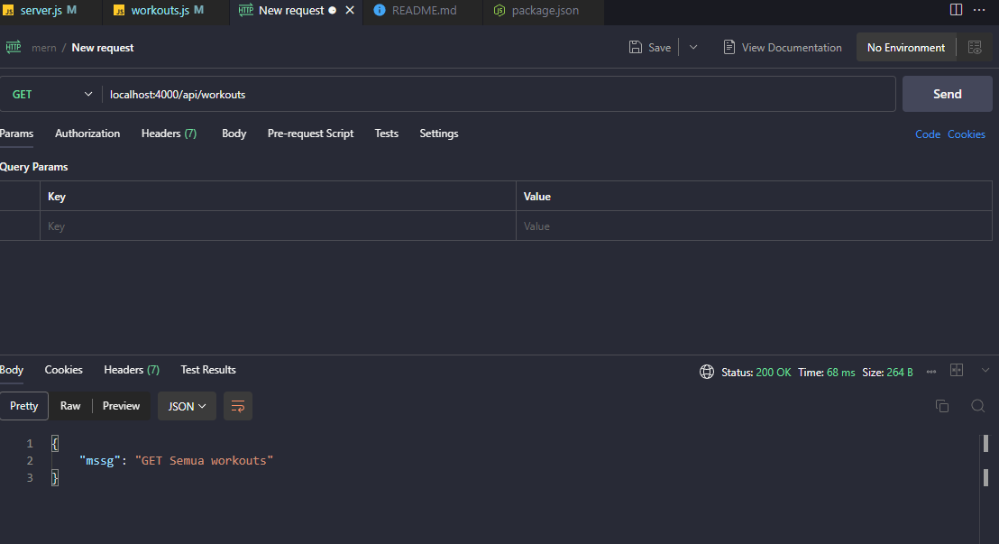
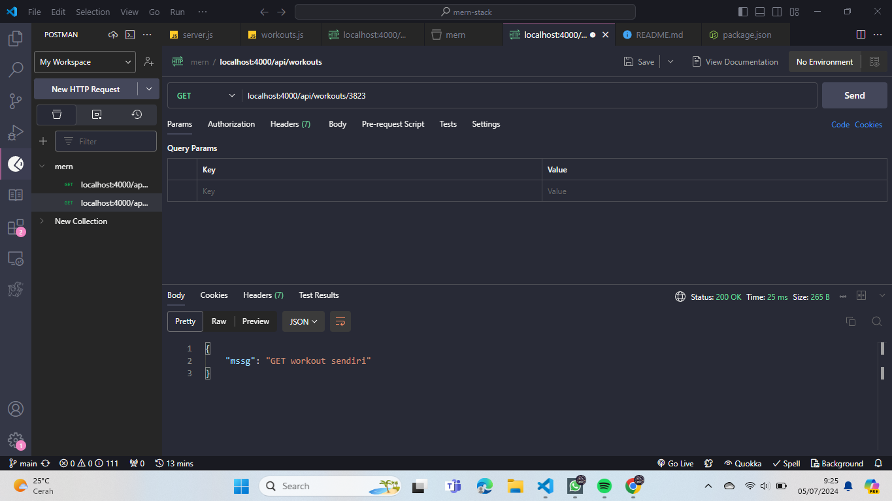
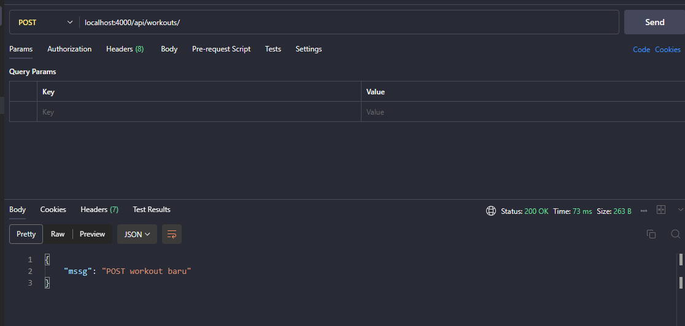
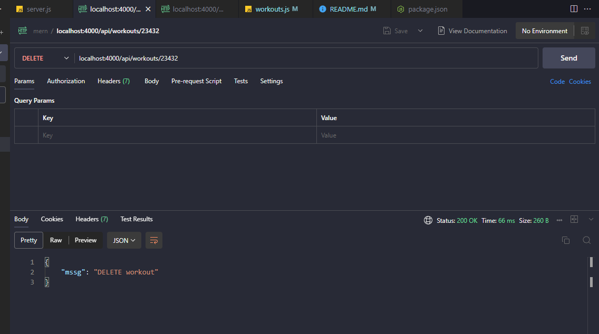
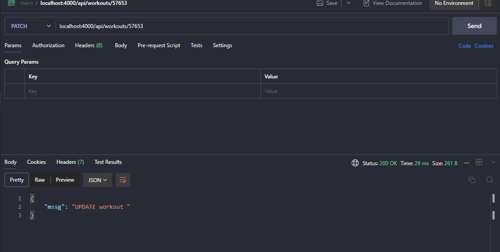

# Mern Stack Muhammad Yusuf
## Penjelasan Video 1
1. **Pengenalan MERN Stack**: MERN stack terdiri dari empat teknologi—MongoDB, Express, React, dan Node.js—yang digunakan bersama untuk membuat aplikasi web interaktif dan berbasis data. Menguasai MERN stack membuat Anda menjadi pengembang full-stack yang mampu membangun bagian depan (front end) dan belakang (back end) dari sebuah situs web.

2. **Penjelasan Teknologi**:
   - **React**: Library front-end untuk membuat antarmuka pengguna dan menangani routing.
   - **Node.js dan Express**: Digunakan untuk membangun API backend yang menangani permintaan dari front-end.
   - **MongoDB**: Database NoSQL untuk menyimpan data aplikasi seperti data pengguna atau blog.

3. **Cara Kerja**: Aplikasi React berjalan di browser untuk menampilkan situs web dan mengirim permintaan data ke backend. Backend (Express di lingkungan Node.js) menangani permintaan ini, berinteraksi dengan database untuk mendapatkan, memperbarui, atau menghapus data, dan kemudian mengirim respons kembali ke aplikasi React di front end.

4. **Keamanan**: Menggunakan backend untuk mengakses database melindungi data sensitif, seperti username dan password admin, dari pengguna situs web, karena kode sensitif tersebut disembunyikan di backend.

5. **Proyek dan Prasyarat**: Seri tutorial ini akan membuat aplikasi pelacakan latihan sebagai proyek. Disarankan memiliki pemahaman dasar tentang masing-masing teknologi sebelum memulai. Tautan ke kursus pengantar untuk setiap teknologi disediakan, serta instruksi untuk menginstal Node.js dan mengunduh file kursus dari GitHub.

## Penjelasan Video 2
1. **Setup Aplikasi Express**: Tutorial dimulai dengan menyiapkan aplikasi Express menggunakan Node.js untuk membuat API yang berkomunikasi dengan database MongoDB dan frontend React.
2. **Struktur Proyek**: Proyek baru dibuat di VS Code dengan dua folder utama: satu untuk kode backend (aplikasi Express) dan satu untuk kode frontend (aplikasi React). Folder backend berisi file entri `server.js`.
3. **Dependencies dan Skrip**: Tutorial menjelaskan cara menginisialisasi file `package.json`, menginstal Express, dan membuat skrip khusus seperti skrip dev untuk menjalankan aplikasi dengan Nodemon.
4. **Variabel Lingkungan**: Dijelaskan cara menyimpan konstanta seperti nomor port di file `.env` untuk menjaga informasi sensitif tetap aman dan tidak terlihat di dalam kode.
5. **Pengujian Rute**: Menggunakan Postman untuk menguji berbagai jenis permintaan (GET, POST, DELETE) ke server dan mencatat rute yang diterima untuk membantu pengembangan lebih lanjut.

## Penjelasan Video 3
- **Menyiapkan Endpoint API**: Tutorial ini membahas tentang menyiapkan berbagai endpoint API untuk aplikasi Express, termasuk handler untuk permintaan GET, POST, DELETE, dan PATCH untuk mengelola data latihan dalam basis data.

- **Mengorganisir Rute**: Alih-alih menempatkan rute langsung di `server.js`, sebuah folder `routes` terpisah dibuat dengan file `workouts.js` untuk menjaga kode tetap rapi dan terorganisir.

- **Menggunakan Express Router**: Express Router digunakan untuk membuat handler rute di `workouts.js`, yang kemudian diekspor dan diintegrasikan ke dalam aplikasi utama menggunakan `app.use()`.

- **Middleware untuk Parsing Permintaan**: Middleware Express `express.json()` digunakan untuk memparsing body permintaan JSON, memungkinkan akses ke data yang dikirim ke server dalam permintaan POST dan PATCH.

- **Pengujian dengan Postman**: Endpoint-endpoint yang dibuat diuji menggunakan Postman untuk memastikan semua rute bekerja dengan benar, dan respons yang diharapkan diterima untuk setiap permintaan.

**Test Api di postman Vs Code**
*Untuk menjalankan code gunakan ``nodemon server.js``
- tes get 

- tes /3823

- tes post 

- delete

- update

